

 

# Despertar da rede neural - Fase 7 - Cap1
Link do vídeo: 

## Nome do Grupo

- Arthur Luiz Rosado Alves -> RM562061
- Renan de Oliveira Mendes -> RM563145

## Sumário
[1. Fase 1 – Base de Dados/API Metereologica](#c1)

[2. Fase 2 – Banco de Dados Estruturado](#c2)

[3. Fase 3 – IoT e Automação](#c3)

[4. Fase 4 – Dashboard Interativo com Data Science](#c4)

[5. Fase 5 – Cloud Computing/Scikit_Learn](#c5)

[6. Fase 6 – Visão Computacional](#c6)

[7. Fase 7 – Consolidação e AW](#c7)

[8. Ir Além 1](#c8)

[9. Ir Além 2](#c9)

# 1. Base de Dados/API Metereologica
Na primeira entrega criamos duas aplicações. Uma  aplicação de entrada de dados em Python e outra aplicação de análise estatísca desses dados, em R - arquivos: "Fase1&2Banco_de_dados.py" e "Analise_R.R"
Utilizamos os registros no arquivo "dados_agricultura.csv".

Além disso, criamos uma aplicação extra, no qual entramos com o nome da cidade, e é realizada a chamada de uma API pública que resgata informações metereologicas do lugar. Essa aplicação simula o controle de uma bomba de água e caso ela detecte uma umidade muito baixa, ela aciona e ativa as bombas de irrigação.

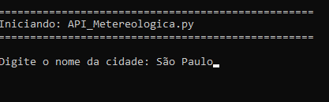
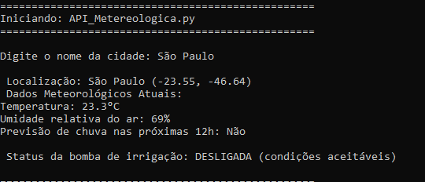

# 2. Fase 2 – Banco de Dados Estruturado

Na segunda entrega, focado na parte estrutural, iniciamos criando um MER, em seguida criamos um banco de dados relacional, com a ferramenta SQL-Developer da Oracle e ampliamos nossa aplicação python, com novas funções CRUD e de seleção de dados.

Link MER: https://github.com/aarthurrosado/Fazenda

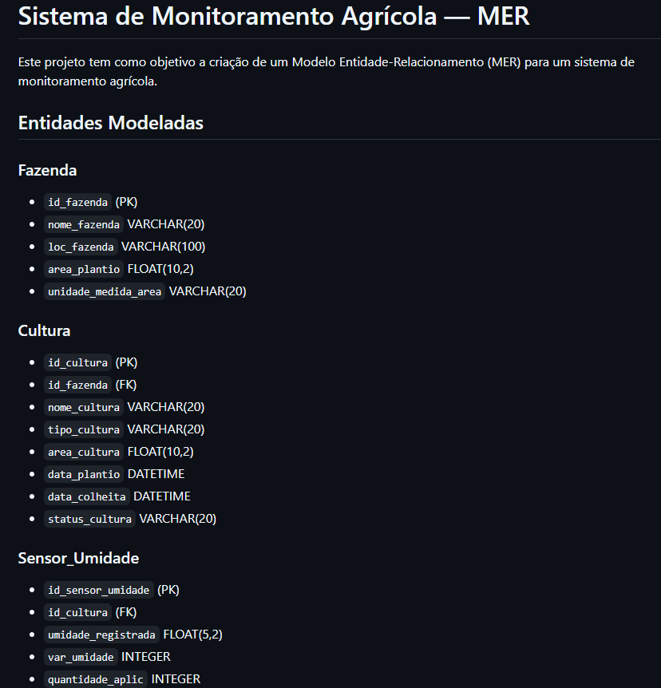

# 3. Fase 3 – Fase 3 – IoT e Automação

Na terceira fase, entramos na parte de Iot com microprocessadores e sensores.
Usando wokwi e sensores reais e criamos uma aplicação de captação e monitoramento de dados. Desenvolveu-se um sistema IoT completo para irrigação automatizada conectado ao banco de dados. Usando a lógica de ativação automática da irrigação.

Link: https://github.com/ReMendess/Maquina_Agricola_Cap1

# 4. Fase 4 – Fase 4 – Dashboard Interativo com Data Science

Na quarta fase, usando Streamlit, integramos Machine Learning em um dashboard online para análise exploratória dos dados. Também aprimoramos nosso ESP32 para monitoramento e criamos algoritmos preditivos de irrigação e manejo agrícola.

Link: https://github.com/ReMendess/Fase_4_Cap_1_Autom.Intelig.

# 5. Fase 5 – Cloud Computing/Scikit_Learn

Quinta fase, usando Scikit_Learn treinamos e testamos diferentes modelos de Machine Learning. Criamos diferentes serviços na AWS, e orçamos em diferentes regiões.
Fomos além e usando ESP32 reais com dois sensores: DHT22 e Capacitive Soil Moisture Sensor v2.0, criamos uma aplicação de monitoramento e visualização via HTML e com protocolo MQTT

Link: https://github.com/ReMendess/Fase_5_Cap_1_FarmTech_Cloud_Comput

# 6. Fase 6 – Visão Computacional

Sexta fase, usando visão computacional com redes neurais, testamos diferentes modelos YOLO, criamos nosso modelo do 0, e ainda realizamos Fine Tunning e Segmentação.
Usando uma base de imagens de cachorros e gatos

Link: https://github.com/ReMendess/Rede_Neural_FIAP_Cap1_Fase6

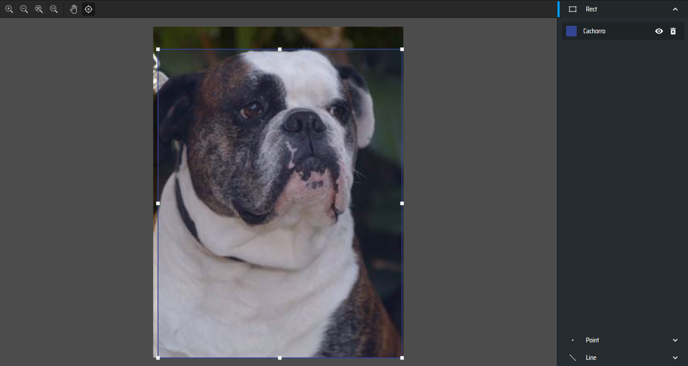

# 7. Fase 7 – Consolidação e AWS.

Nessa última fase, consolidamos todas as aplicações em uma só - "Fase7.py"
Nela podemos realizar a inserção de dados, operações CRUD, consultar API, captar dados com ESP32, treinar diversos modelos com Scikit Learn, ou treinar modelos de redes neuras com Yolo.

Além disso, aprofundamos com AWS hospedando alguns dos nossos serviços e infra garatindo a disponibilidade e escalabilidade.

### Aplicação final:
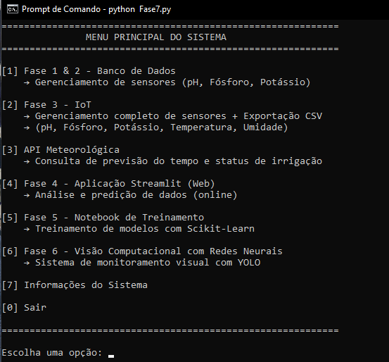

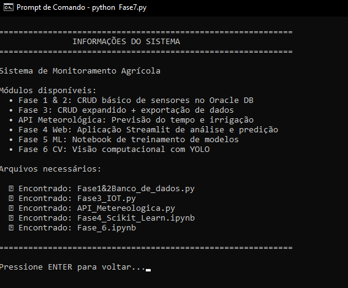

### Aqui criamos serviços de armazenamento de dados com DynamoDB

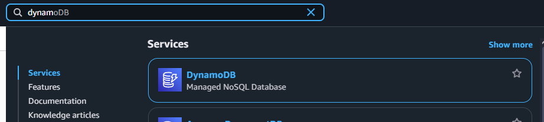

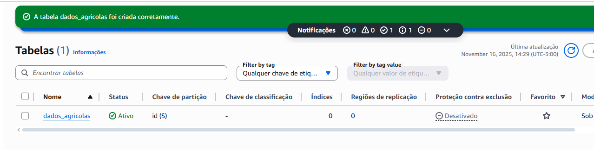

### Criamos um bucket com S3
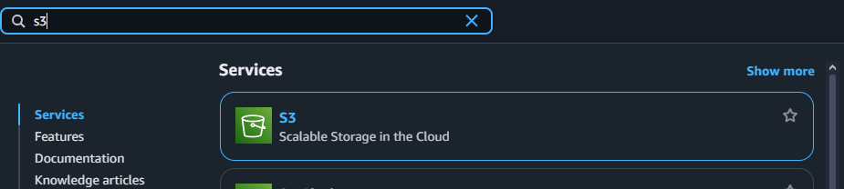

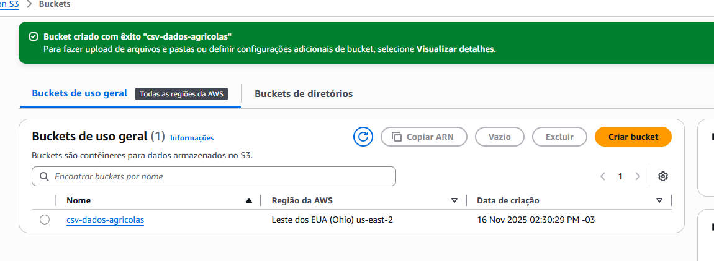

# 8. Ir Além 1
Usando AWS Rekognition, configuramos e criamos um serviço de reconhecimento de imagem.

### Criamos um bucket e subimos imagens
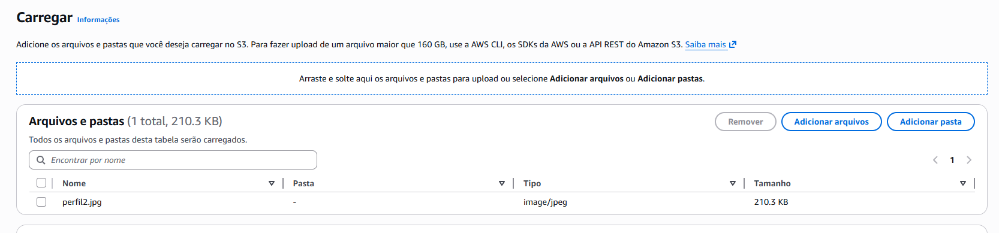

### Atualizamos as politicas e criamos um usúario com permissão para usar o serviço do Rekognition
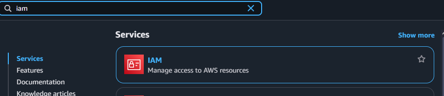

### Acessando o Rekognition montamos toda a estrutura, pegando as imagens do bucket para treinar o modelo, rotular e dar deploy
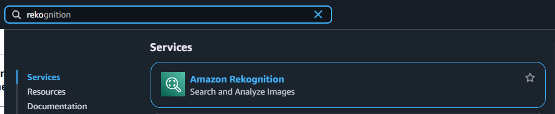

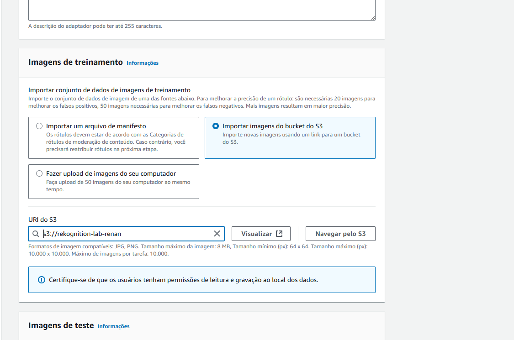

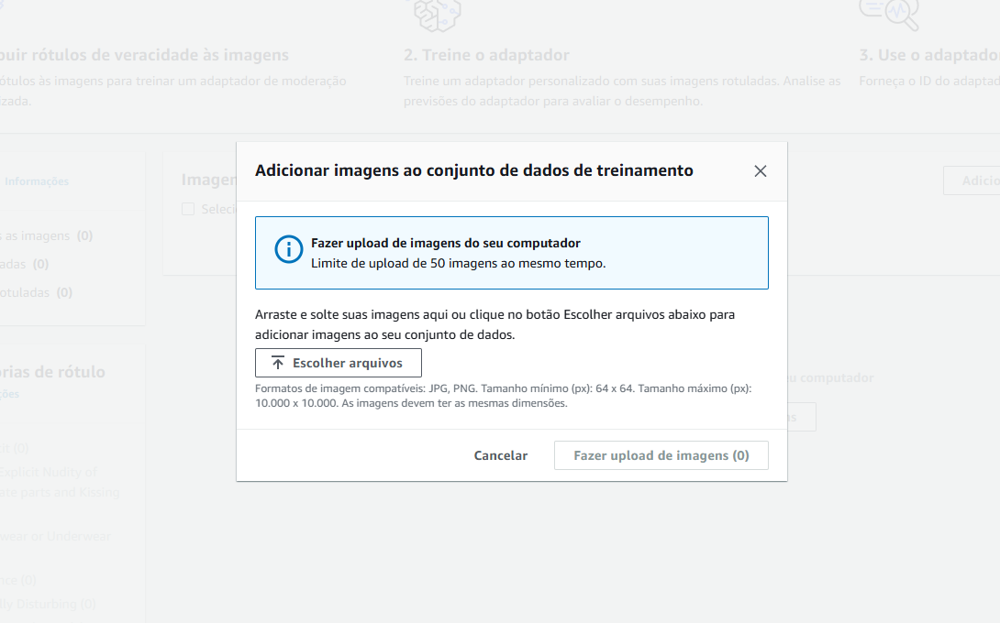

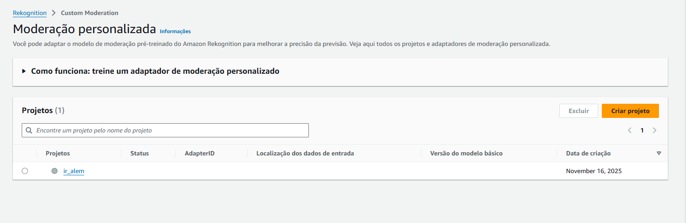

# 9. Ir Além 2

